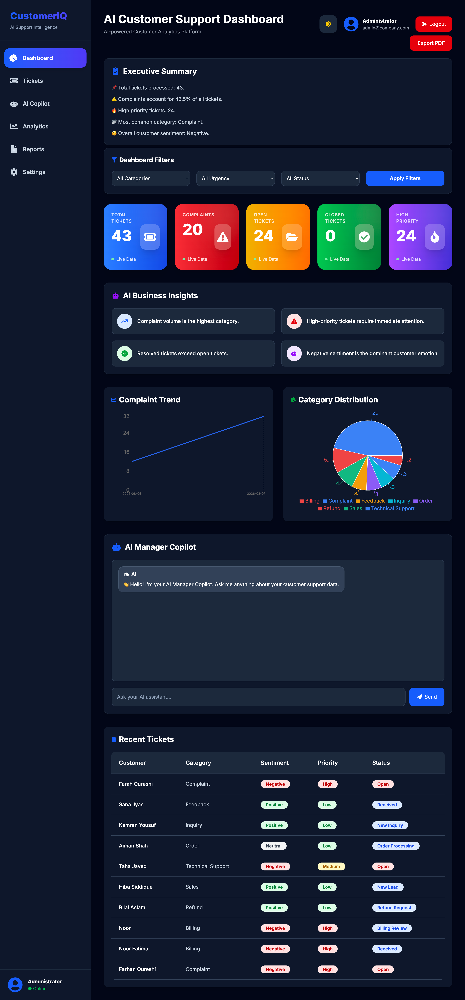
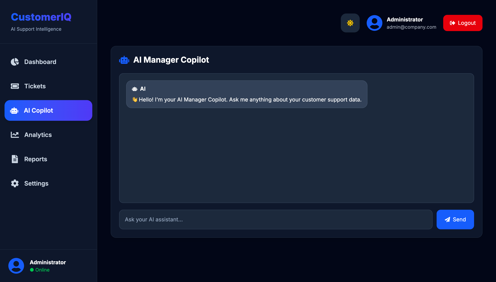
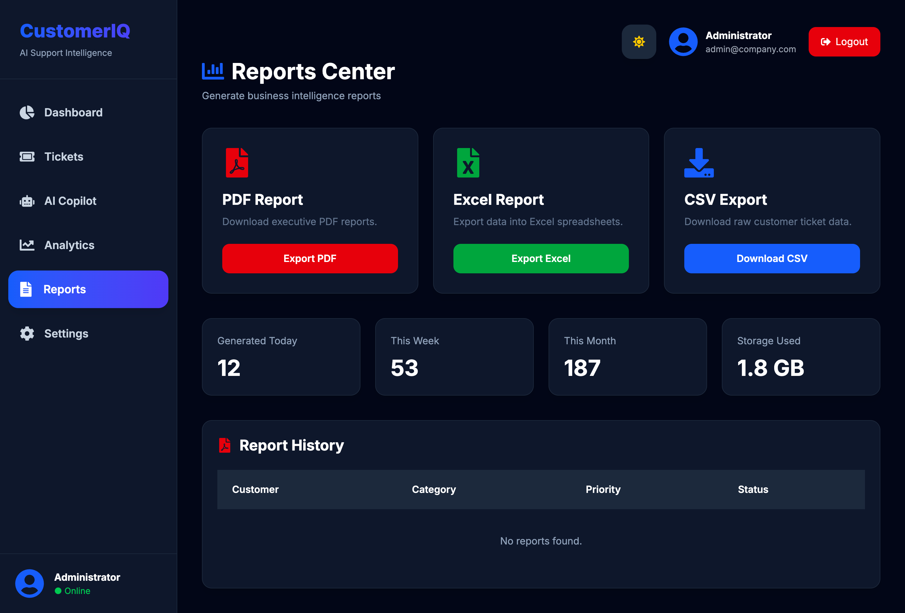
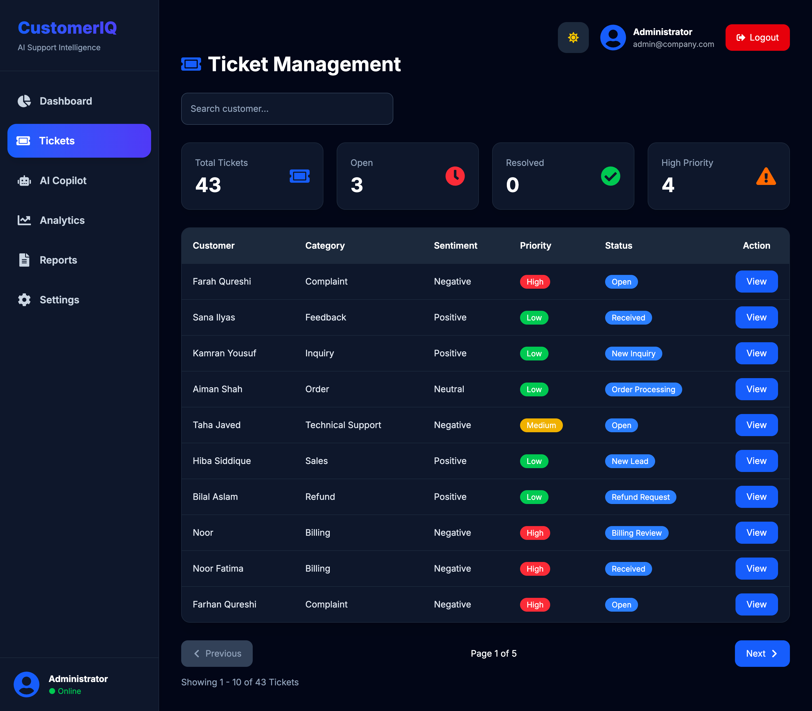

#  AI Customer Support Automation System

##  Project Overview

AI Customer Support Automation is a full-stack application that automates customer support using Artificial Intelligence, FastAPI, PostgreSQL, React, and n8n workflows.

The system classifies customer messages, analyzes sentiment and urgency, routes tickets automatically, stores records in PostgreSQL, generates analytics dashboards, and provides an AI-powered SQL Copilot for business users.

This project demonstrates an end-to-end AI automation workflow suitable for modern customer support teams.

##  Features

- AI-powered customer message classification
- Sentiment Analysis
- Urgency Detection
- Automatic Ticket Routing
- Email Notification using Gmail
- Duplicate Ticket Detection
- PostgreSQL Database Integration
- Interactive Dashboard
- Analytics Dashboard
- AI SQL Copilot
- Executive Summary Generation
- Business Insights
- Report Export (CSV & Excel)
- Predictive AI Analytics
- n8n Workflow Automation

##  Tech Stack

### Backend
- FastAPI
- Python
- Ollama (Llama 3.2)
- PostgreSQL

### Frontend
- React
- Tailwind CSS
- Axios
- Recharts

### Automation
- n8n
- Gmail API

### Database
- PostgreSQL

### AI
- Ollama
- Llama 3.2

##  Project Structure

```text
ai-automation-project/
│
├── frontend/
├── src/
│   ├── database/
│   ├── services/
│   └── main.py
│
├── n8n/
│   ├── customer-support-workflow.json
│   ├── daily-executive-report.json
│   └── trend-detection.json
│
├── data/
├── screenshots/
├── requirements.txt
└── README.md
```

##  System Workflow

Customer Message

↓

FastAPI API

↓

Ollama AI Classification

↓

n8n Workflow

↓

Switch Routing

↓

PostgreSQL

↓

Dashboard & Analytics

↓

Email Notifications


##  Screenshots

### Dashboard



### Analytics


### AI Copilot



### Reports



### Ticket Management




## Installation

Clone the repository

```bash
git clone https://github.com/yourusername/AI-Customer-Support-Automation.git
```

Backend

```bash
cd src

python -m venv venv

source venv/bin/activate

pip install -r ../requirements.txt

uvicorn main:app --reload
```

Frontend

```bash
cd frontend

npm install

npm run dev
```

## API Endpoints

| Method | Endpoint | Description |
|--------|----------|-------------|
| POST | /analyze | Analyze customer message |
| POST | /workflow | Trigger n8n workflow |
| POST | /copilot | AI SQL Copilot |
| GET | /dashboard | Dashboard statistics |
| GET | /analytics/* | Analytics APIs |
| GET | /reports/* | Reports |

##  Future Improvements

- JWT Authentication
- Role-Based Access Control
- Multi-language Support
- Live Chat Integration
- WhatsApp Integration
- OpenAI Integration
- Cloud Deployment

##  Author

**Suniya Zulfiqar**

BBA (Marketing) | AI Automation & Data Analytics Enthusiast

Karachi, Pakistan